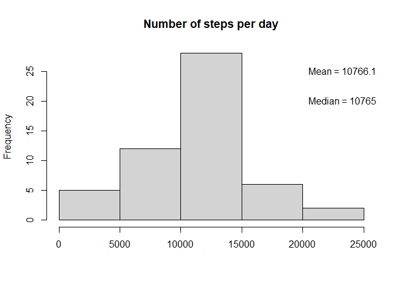
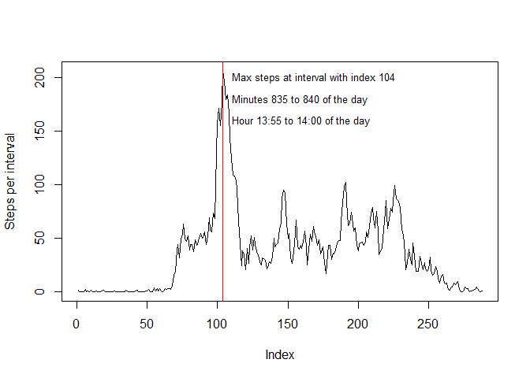
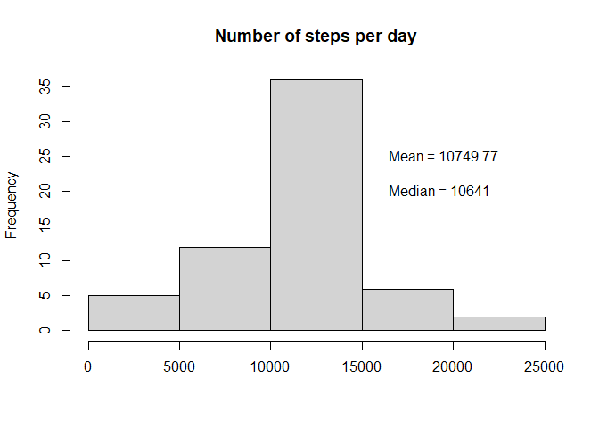
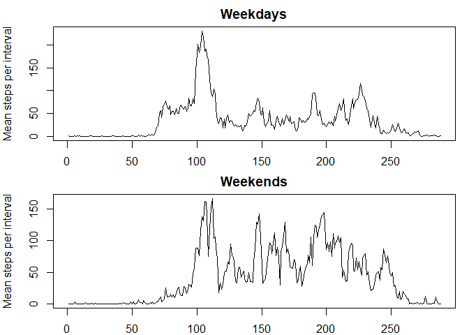

## Loading and preprocessing the data  


```r
unzip("activity.zip")  
act<-read.csv("activity.csv")  
sum_steps<-with(act,tapply(steps, date, sum))
```

## What is mean total number of steps taken per day?  


```r
hist(sum_steps, main="Number of steps per day", xlab=NULL)   
mean1<-mean(sum_steps, na.rm=TRUE)   
median1<-median(sum_steps, na.rm =TRUE)    
text(20000,25,pos=4, paste0("Mean = ", round(mean1, digits=2)))  
text(20000,20, pos=4, paste0("Median = ", median1))
```

<!-- -->

## What is the average daily activity pattern?  


```r
avg_st<-with(act,tapply(steps, interval, mean, na.rm=TRUE))  
plot(avg_st, type="l", ylab="Steps per interval")  
max_step<-which.max(avg_st)  
abline(v=max_step, col="red")  
text(105,200, pos=4, paste0("Max steps at interval with index ", max_step), cex=0.8)  
text(105, 180, pos=4, paste0("Minutes ", names(avg_st[104]), " to ", names(avg_st[105]), " of the day "), cex=0.8)  
text(105, 160, pos=4, paste0("Hour ", as.integer(835/60), ":", 835%%60, " to ", as.integer(840/60), ":00"," of the day"), cex=0.8)  
```

<!-- -->

## Imputing missing values  


```r
table(is.na(act))  
```

```
## 
## FALSE  TRUE 
## 50400  2304
```

```r
print(paste0("number of NA values is ", sum(is.na(act))))  
```

```
## [1] "number of NA values is 2304"
```

```r
library(dplyr)  
```

```
## 
## Attaching package: 'dplyr'
```

```
## The following objects are masked from 'package:stats':
## 
##     filter, lag
```

```
## The following objects are masked from 'package:base':
## 
##     intersect, setdiff, setequal, union
```

```r
library(data.table)  
```

```
## 
## Attaching package: 'data.table'
```

```
## The following objects are masked from 'package:dplyr':
## 
##     between, first, last
```

```r
setDT(act) 
cols<-"steps"
act2<-act[, (cols) := lapply(.SD, function(x) nafill(x, type = "const", fill = mean(x, na.rm = TRUE))), by = interval , .SDcols = cols][]
sum_steps2<-with(act2,tapply(steps, date, sum))
hist(sum_steps2, main="Number of steps per day", xlab=NULL)
mean2<-mean(sum_steps2, na.rm=TRUE)
median2<-median(sum_steps2, na.rm =TRUE)
text(16000,25,pos=4, paste0("Mean = ", round(mean2, digits=2)))
text(16000,20, pos=4, paste0("Median = ", median2))
```

<!-- -->

## Are there differences in activity patterns between weekdays and weekends?  


```r
act2$date<-as.Date(act2$date)
act2<-mutate(act2, weekday=weekdays(date))
weeek<-function(x){
  ifelse (x %in% c("Monday", "Tuesday", "Wednesday", "Thursday", "Friday"), "Weekday", "Weekend")
    }
act2<-mutate(act2, weekday2=weeek(weekday))

act2_wd<-subset(act2, weekday2=="Weekday")
act2_we<-subset(act2, weekday2=="Weekend")
mean_wd<-with(act2_wd,tapply(steps, interval, mean, na.rm=TRUE))
mean_we<-with(act2_we,tapply(steps, interval, mean, na.rm=TRUE))
par(mfrow=c(2,1),mar=c(2,4,2,1))
plot(mean_wd, type="l", main="Weekdays", ylab="Mean steps per interval")
plot(mean_we, type="l", main="Weekends", ylab="Mean steps per interval")
```

<!-- -->
